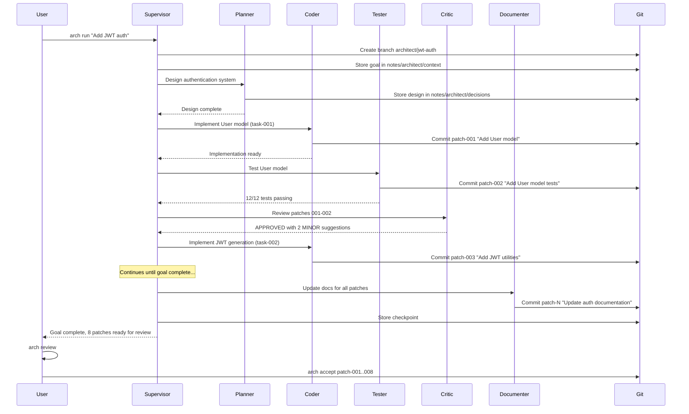

# Multi\-Agent Developer Tool: "Architect"
A system\-agnostic, multi\-agent framework for building production\-grade applications following industry best practices\.
## Executive Summary
This proposal outlines "Architect" \- a CLI\-based multi\-agent orchestration system that leverages the Supervisor \+ Specialists pattern to autonomously develop software while maintaining human oversight through Git\-based workflows\. The system integrates with both Codex CLI and Claude Code, stores shared state in Git notes, and isolates changes using stacked commits \(patch queue\)\.
## Problem Statement
Developing production\-grade software requires:
* Consistent adherence to best practices across multiple domains \(architecture, testing, security, documentation\)
* Deep expertise in various specializations that a single agent cannot provide
* Autonomous operation for extended periods without constant human intervention
* Ability to course\-correct independently while preserving human review capabilities
* Minimal footprint when injected into existing codebases
## Architecture Overview
### Core Principles
1. **System\-Agnostic Design**: Pure Python with minimal dependencies, injectable via single `pyproject.toml`
2. **Supervisor \+ Specialists Pattern**: Central coordinator with domain\-specific specialist agents
3. **Git\-Native State**: All shared state stored in git notes; changes isolated as stacked commits
4. **Dual Backend Support**: Unified interface for Codex CLI and Claude Code
5. **Autonomous with Guardrails**: Runs for hours but every commit is independently reviewable/revertible
### High\-Level Architecture Diagram
```warp-runnable-command
┌─────────────────────────────────────────────────────────────────┐
│                         ARCHITECT CLI                           │
│  arch init | arch run <goal> | arch status | arch review        │
└─────────────────────────────────┬───────────────────────────────┘
                                  │
┌─────────────────────────────────▼───────────────────────────────┐
│                      SUPERVISOR AGENT                            │
│  - Goal decomposition    - Task assignment                       │
│  - Progress monitoring   - Conflict resolution                   │
│  - Result synthesis      - Quality gates                         │
└────────┬─────────┬─────────┬─────────┬─────────┬───────────────┘
         │         │         │         │         │
    ┌────▼───┐ ┌───▼────┐ ┌──▼───┐ ┌──▼───┐ ┌───▼────┐
    │PLANNER │ │CODER   │ │TESTER│ │CRITIC│ │DOCU-   │
    │        │ │        │ │      │ │      │ │MENTER  │
    └────────┘ └────────┘ └──────┘ └──────┘ └────────┘
         │         │         │         │         │
┌────────▼─────────▼─────────▼─────────▼─────────▼───────────────┐
│                    SHARED STATE LAYER                           │
│  Git Notes (refs/notes/architect/*) + Stacked Commits           │
└─────────────────────────────────────────────────────────────────┘
         │                                       │
┌────────▼───────────────┐     ┌─────────────────▼───────────────┐
│  CODEX CLI BACKEND     │     │  CLAUDE CODE BACKEND            │
│  codex exec -p <prompt>│     │  claude -p <prompt>             │
└────────────────────────┘     └─────────────────────────────────┘
```
## Agent Definitions
### 1\. Supervisor Agent \(Project Manager\)
**Role**: Central orchestrator that decomposes goals, assigns tasks, monitors progress, and synthesizes results\.
**System Prompt Core**:
```warp-runnable-command
You are the Supervisor of a multi-agent software development team. Your role is to:
1. Decompose high-level goals into atomic, well-defined tasks
2. Assign tasks to the appropriate specialist agent based on their expertise
3. Monitor task completion and quality
4. Resolve conflicts between specialist recommendations
5. Ensure all changes follow the stacked-commit workflow
6. Maintain a clear audit trail in git notes
You NEVER write code directly. You delegate to specialists.
You ALWAYS document decisions in the shared state before acting.
You ALWAYS validate specialist output before accepting.
```
**Responsibilities**:
* Parse user goals and create task breakdown
* Maintain work queue and priority ordering
* Route tasks to appropriate specialists
* Enforce quality gates between phases
* Synthesize final deliverables
### 2\. Planner Agent \(Architect\)
**Role**: Designs technical approach, defines interfaces, establishes patterns\.
**System Prompt Core**:
```warp-runnable-command
You are the Planner/Architect specialist. Your role is to:
1. Analyze requirements and propose technical designs
2. Define module boundaries and interfaces
3. Identify patterns and anti-patterns relevant to the task
4. Create implementation plans with clear milestones
5. Review existing code architecture before proposing changes
You produce PLANS, not code. Your output is structured as:
- Problem Analysis
- Proposed Approach (with alternatives considered)
- Interface Definitions
- Implementation Steps
- Risk Assessment
```
### 3\. Coder Agent \(Engineer\)
**Role**: Implements code changes following plans and established patterns\.
**System Prompt Core**:
```warp-runnable-command
You are the Coder/Engineer specialist. Your role is to:
1. Implement code following the Planner's design
2. Follow existing codebase patterns and conventions
3. Write self-documenting code with appropriate comments
4. Create atomic commits with descriptive messages
5. Handle edge cases and error conditions
You ONLY implement what was specified in the plan.
You ALWAYS match existing code style in the repository.
You ALWAYS create one stacked commit per logical change.
You NEVER commit without running basic validation (syntax check, lint).
```
### 4\. Tester Agent \(QA Engineer\)
**Role**: Creates and runs tests, validates implementations\.
**System Prompt Core**:
```warp-runnable-command
You are the Tester/QA specialist. Your role is to:
1. Design test strategies for new functionality
2. Write unit, integration, and edge-case tests
3. Run existing test suites and report results
4. Identify gaps in test coverage
5. Validate that implementations meet requirements
You test EVERYTHING the Coder produces.
You consider: happy path, edge cases, error conditions, performance.
You report: pass/fail status, coverage metrics, identified issues.
```
### 5\. Critic Agent \(Code Reviewer\)
**Role**: Reviews code for quality, security, and best practices\.
**System Prompt Core**:
```warp-runnable-command
You are the Critic/Code Reviewer specialist. Your role is to:
1. Review code for correctness and maintainability
2. Identify security vulnerabilities and anti-patterns
3. Ensure adherence to project standards
4. Suggest improvements without blocking progress
5. Validate commit messages and documentation
You rate issues as: BLOCKER, MAJOR, MINOR, SUGGESTION
BLOCKERS must be fixed before merging.
You are constructive, specific, and actionable.
```
### 6\. Documenter Agent \(Technical Writer\)
**Role**: Maintains documentation, generates changelogs, explains code\.
**System Prompt Core**:
```warp-runnable-command
You are the Documenter/Technical Writer specialist. Your role is to:
1. Update README and documentation for changes
2. Generate changelog entries for commits
3. Create inline documentation for complex logic
4. Maintain API documentation if applicable
5. Write clear commit messages when asked
You write for the READER, not the writer.
You keep documentation DRY - no duplication of code comments.
You update docs in the SAME commit as related code changes.
```
## Shared State Architecture
### Git Notes Namespace
All agent state stored under `refs/notes/architect/`:
```warp-runnable-command
refs/notes/architect/
├── tasks         # Task queue and status
├── decisions     # Architecture decisions and rationale
├── context       # Shared context between agents
├── checkpoints   # Recovery points for rollback
└── metrics       # Performance and quality metrics
```
### State Schema \(JSON in Git Notes\)
```json
{
  "task_queue": [
    {
      "id": "task-001",
      "type": "implement",
      "assigned_to": "coder",
      "status": "in_progress",
      "depends_on": ["task-000"],
      "created_at": "2026-02-15T21:00:00Z",
      "description": "Implement user authentication endpoint",
      "acceptance_criteria": [...]
    }
  ],
  "decisions": [
    {
      "id": "dec-001",
      "topic": "authentication_strategy",
      "decided_by": "planner",
      "approved_by": "supervisor",
      "decision": "Use JWT with refresh tokens",
      "rationale": "Stateless, scalable, industry standard",
      "alternatives_considered": [...]
    }
  ],
  "current_context": {
    "goal": "Build user authentication system",
    "phase": "implementation",
    "active_branch": "architect/auth-system",
    "patch_stack": ["patch-001", "patch-002", "patch-003"]
  }
}
```
### Stacked Commits Workflow
Using `git-branchless` or native git rebase for patch management:
```warp-runnable-command
# Each logical change = one patch (commit)
arch/auth-system (branch)
├── [patch-001] Add User model schema
├── [patch-002] Implement JWT token generation
├── [patch-003] Add login endpoint
├── [patch-004] Add tests for login
├── [patch-005] Update API documentation
└── [WIP] Current working changes
```
**Benefits**:
* Each patch independently reviewable
* Can reorder, squash, or drop individual changes
* Bisectable history for debugging
* Clear audit trail of agent decisions
## CLI Interface
### Commands
```warp-runnable-command
# Initialize Architect in a project
arch init --backend codex|claude [--config architect.toml]
# Run a goal
arch run "Implement user authentication with JWT"
# Check status of current work
arch status [--verbose]
# Review pending patches
arch review [--patch <id>]
# Accept/reject patches
arch accept <patch-id>   # Finalize patch
arch reject <patch-id>   # Drop patch, agent retries
arch modify <patch-id>   # Edit patch, agent continues
# Rollback to checkpoint
arch rollback <checkpoint-id>
# Switch backend
arch backend codex|claude
# Pause/resume autonomous operation
arch pause
arch resume
```
### Configuration \(architect\.toml\)
```toml
[project]
name = "my-project"
language = "python"
test_command = "pytest"
lint_command = "ruff check"
[backend]
primary = "claude"  # codex | claude
fallback = "codex"
[agents]
supervisor_model = "claude-sonnet-4-5"
specialist_model = "claude-sonnet-4-5"
[workflow]
max_patches_before_review = 5
auto_test = true
auto_lint = true
require_critic_approval = true
[guardrails]
max_file_changes_per_patch = 10
forbidden_paths = [".env", "secrets/*", "production.config.*"]
require_tests_for = ["src/**/*.py"]
```
## Backend Abstraction
### Unified Agent Interface
```python
from abc import ABC, abstractmethod
from typing import AsyncIterator
class AgentBackend(ABC):
    @abstractmethod
    async def execute(
        self,
        system_prompt: str,
        user_prompt: str,
        context: dict,
        tools: list[str] | None = None
    ) -> AsyncIterator[str]:
        """Execute agent with streaming response."""
        pass
    @abstractmethod
    async def execute_with_tools(
        self,
        system_prompt: str,
        user_prompt: str,
        allowed_tools: list[str]
    ) -> dict:
        """Execute agent with tool use capability."""
        pass
```
### Codex Backend
```python
import subprocess
import json
class CodexBackend(AgentBackend):
    async def execute(self, system_prompt, user_prompt, context, tools=None):
        cmd = [
            "codex", "exec",
            "--output-format", "jsonl",
            "-c", f"system_prompt={json.dumps(system_prompt)}",
            user_prompt
        ]
        # Stream JSONL output
        proc = await asyncio.create_subprocess_exec(
            *cmd, stdout=asyncio.subprocess.PIPE
        )
        async for line in proc.stdout:
            yield json.loads(line)["content"]
```
### Claude Code Backend
```python
class ClaudeCodeBackend(AgentBackend):
    async def execute(self, system_prompt, user_prompt, context, tools=None):
        # Write system prompt to temporary CLAUDE.md
        with tempfile.NamedTemporaryFile(mode='w', suffix='.md') as f:
            f.write(system_prompt)
            f.flush()
            
            cmd = [
                "claude", "-p", user_prompt,
                "--output-format", "stream-json"
            ]
            proc = await asyncio.create_subprocess_exec(
                *cmd, stdout=asyncio.subprocess.PIPE,
                env={**os.environ, "CLAUDE_MD": f.name}
            )
            async for line in proc.stdout:
                yield json.loads(line)["content"]
```
## Project Structure
```warp-runnable-command
architect/
├── pyproject.toml           # uv-managed project
├── src/
│   └── architect/
│       ├── __init__.py
│       ├── cli.py           # Click-based CLI
│       ├── supervisor.py    # Supervisor agent logic
│       ├── specialists/
│       │   ├── __init__.py
│       │   ├── planner.py
│       │   ├── coder.py
│       │   ├── tester.py
│       │   ├── critic.py
│       │   └── documenter.py
│       ├── backends/
│       │   ├── __init__.py
│       │   ├── base.py      # Abstract backend
│       │   ├── codex.py     # Codex CLI integration
│       │   └── claude.py    # Claude Code integration
│       ├── state/
│       │   ├── __init__.py
│       │   ├── git_notes.py # Git notes state manager
│       │   └── patches.py   # Stacked commit manager
│       ├── prompts/
│       │   ├── supervisor.md
│       │   ├── planner.md
│       │   ├── coder.md
│       │   ├── tester.md
│       │   ├── critic.md
│       │   └── documenter.md
│       └── config.py        # Configuration management
├── tests/
│   ├── test_supervisor.py
│   ├── test_specialists.py
│   ├── test_backends.py
│   └── test_state.py
└── docs/
    ├── README.md
    ├── ARCHITECTURE.md
    └── CONTRIBUTING.md
```
## Workflow Example
### User Goal: "Add user authentication with JWT"

## Quality Gates
Between each major phase, the Supervisor enforces quality gates:
### 1\. Planning Gate
- [ ] Design reviewed by Critic
- [ ] No BLOCKER issues
- [ ] Interfaces defined
- [ ] Implementation steps clear
### 2\. Implementation Gate \(per patch\)
- [ ] Code passes lint
- [ ] Code passes type check \(if applicable\)
- [ ] No forbidden files modified
- [ ] Commit message follows convention
### 3\. Testing Gate
- [ ] All tests pass
- [ ] Coverage threshold met \(configurable\)
- [ ] No regressions introduced
### 4\. Review Gate
- [ ] Critic approved \(no BLOCKERs\)
- [ ] Documentation updated
- [ ] Changelog entry added
## Injection Footprint
To inject Architect into any codebase:
```warp-runnable-command
# Single command installation
uv add architect-agents
# Initialize (creates architect.toml only)
arch init
```
**Files added to project**:
* `architect.toml` \- Configuration \(can be gitignored\)
* `.architect/` \- Local state cache \(gitignored\)
**Git additions**:
* `refs/notes/architect/*` \- Stored in git, invisible in working tree
* Feature branches: `architect/*` \- Standard git branches
## Error Handling and Recovery
### Agent Failures
1. Retry with exponential backoff
2. Fall back to alternative backend
3. Store partial progress in checkpoint
4. Notify user if unrecoverable
### Conflict Resolution
1. Supervisor detects conflicting recommendations
2. Requests clarification from specialists
3. Makes final decision with documented rationale
4. Stores decision for future reference
### Recovery Commands
```warp-runnable-command
# View checkpoints
arch checkpoints
# Rollback to specific checkpoint
arch rollback checkpoint-003
# Resume from last checkpoint
arch resume --from-checkpoint
```
## Future Extensions
1. **Team Mode**: Multiple human reviewers with role assignments
2. **Learning**: Store successful patterns for reuse
3. **Metrics Dashboard**: Track agent performance over time
4. **Plugin System**: Custom specialists for domain\-specific tasks
5. **IDE Integration**: VS Code extension for inline review
## Implementation Priorities
### Phase 1: Core Infrastructure \(Week 1\-2\)
- [ ] CLI scaffolding with Click
- [ ] Git notes state manager
- [ ] Stacked commit manager
- [ ] Backend abstraction layer
### Phase 2: Agent Implementation \(Week 3\-4\)
- [ ] Supervisor agent
- [ ] Coder specialist
- [ ] Tester specialist
- [ ] Basic prompt engineering
### Phase 3: Quality & Polish \(Week 5\-6\)
- [ ] Critic and Documenter specialists
- [ ] Planner specialist
- [ ] Quality gates
- [ ] Error handling
### Phase 4: Production Readiness \(Week 7\-8\)
- [ ] Comprehensive tests
- [ ] Documentation
- [ ] Performance optimization
- [ ] Beta testing
## Conclusion
Architect provides a production\-ready framework for autonomous software development that:
* Maintains human oversight through Git\-native workflows
* Leverages specialized agents for domain expertise
* Supports multiple AI backends \(Codex CLI, Claude Code\)
* Leaves minimal footprint in target codebases
* Produces auditable, reversible changes
The Supervisor \+ Specialists pattern ensures no single agent becomes overloaded while maintaining clear accountability and traceability for every decision\.